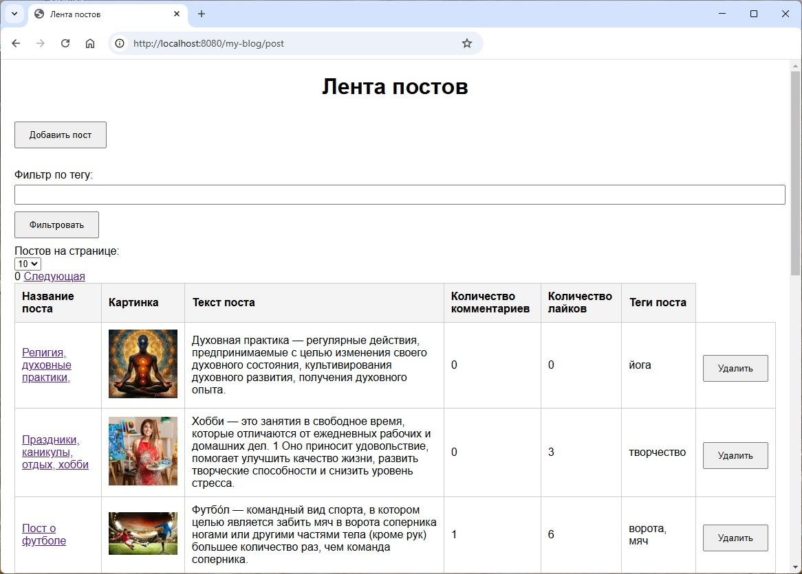
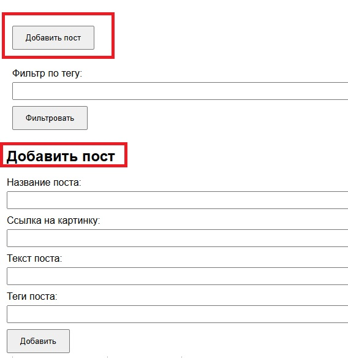
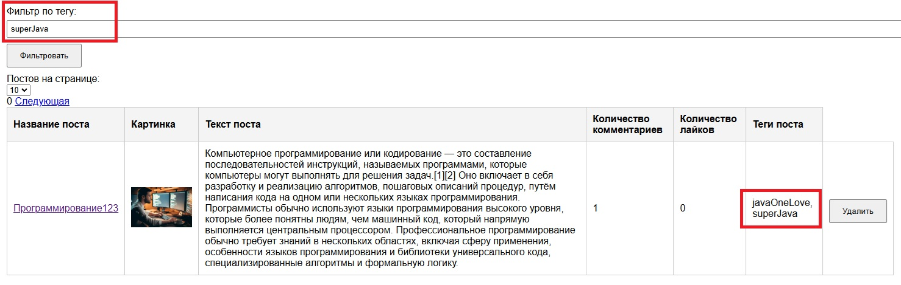
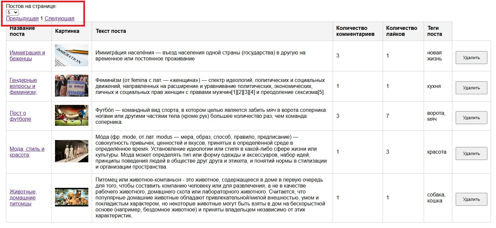
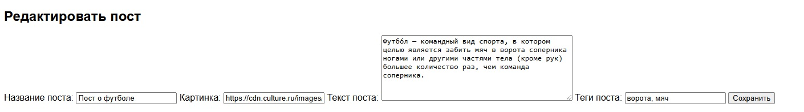

# my-blog

Веб приложение-блог на Spring Framework без использования Spring Boot. Включает в себя функциональность для создания, 
отображения, редактирования и удаления постов, управления тегами, лайками, комментариями.

## Стек технологий

- **Java 21**
- **Spring Framework**
- **Spring MVC** для обработки HTTP-запросов
- **Spring JDBC** для работы с базой данных
- **Postgres** база данных
- **Flyway** для миграции базы данных
- **H2** база данных для тестирования
- **JUnit 5** для тестирования
- **Mapstruct** для преобразования сущностей базы данных и сущностей передачи данных
- **MockMvc** для интеграционного тестирования
- **Thymeleaf** для шаблонов html страниц
- **Spring validation** для валидации пользовательских данных
- **Lombok** для генерации шаблонного кода
- **Docker** для запуска контейнеров postgres и tomcat 

## Запуск приложения 

Склонировать репозиторий с кодом и перейти в корневую директорию проекта.

```bash
git clone https://github.com/alextim1508/myblog
```

Собрать jar архив.

```bash
gradle bootJar
```

Запустить docker compose файл.

```bash
docker-compose -f docker-compose.yml up -d 
```


Открыть в браузере вкладку с адресом.

```bash
http://localhost:8080/post
```



Откроется список постов

Для добавления нового поста необходимо нажать на кнопку "Добавить пост", откроется форма для ввода информации о посте.



В ленте реализован фильтр по тегам поста. Для фильтрации постов необходимо ввести в поле "Фильтр по тегу" интересующий 
тег и нажать на кнопку "Фильтровать".



Так же можно выбрать количество постов для отображения на странице. Для этого необходимо выбрать в выпадающем списке 
"Постов на странице" количество отображаемых постов. Для переключения страниц есть ссылки "Предыдущая" и "Следующая".



Каждое название поста является ссылкой для отображения полной информации о посте.


Кнопки "Удалить пост", "Редактировать", "Лайк" выполняют соответствующие названиям действия к посту. 



Для редактирования комментариев необходимо кликнуть по полю с комментарием, отредактировать его и нажать на кнопку 
"Сохранить" или нажать клавиши Ctrl + Enter

