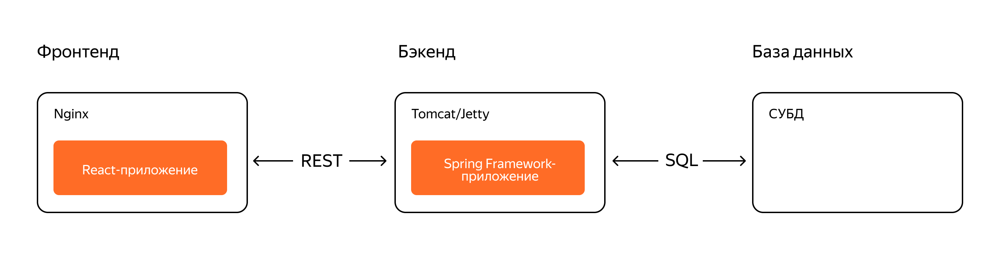
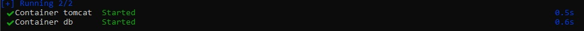
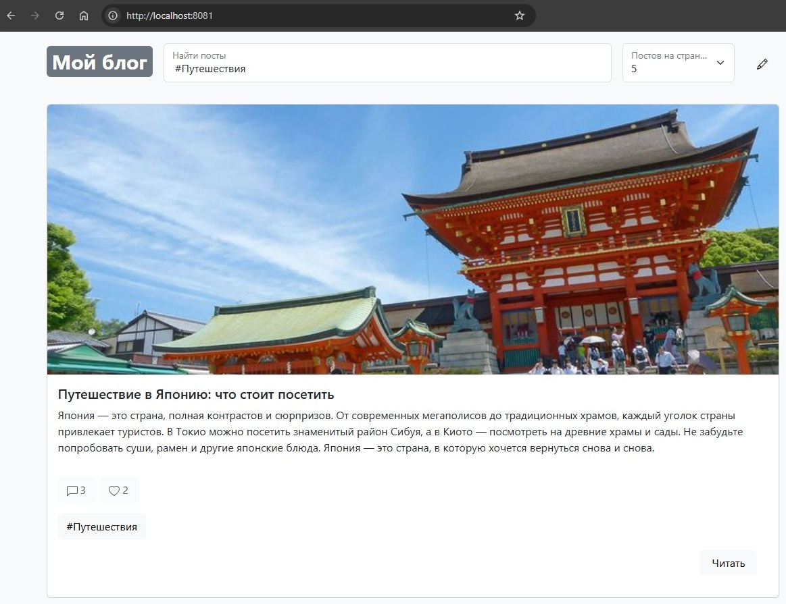
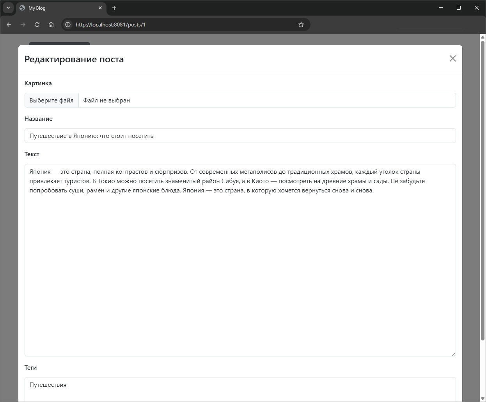

# 📝 my-blog

Веб приложение-блог на Spring Framework. Включает в себя функциональность для создания, 
отображения, редактирования и удаления постов, управления тегами, лайками, комментариями.

## 🛠️ Стек технологий

- **Java 21**
- **Spring Framework**
- **Spring MVC** для обработки HTTP-запросов
- **Spring JDBC** для работы с базой данных
- **Postgres** база данных
- **Flyway** для миграции базы данных
- **H2** база данных для тестирования
- **JUnit 5** для тестирования
- **Mapstruct** для преобразования сущностей базы данных и сущностей передачи данных
- **MockMvc** для интеграционного тестирования
- **Spring validation** для валидации пользовательских данных
- **Lombok** для генерации шаблонного кода
- **Docker** для запуска контейнеров postgres и tomcat 

## 🧩 Архитектура



## 🚀 Запуск приложения

Склонировать репозиторий с кодом и перейти в корневую директорию проекта.

```bash
git clone https://github.com/alextim1508/myblog
```

Собрать jar архив.

```bash
gradle bootJar
```

Запустить docker compose файл.

```bash
docker-compose -f docker-compose.yml up -d 
```


Открыть в браузере вкладку с адресом.

```bash
http://localhost:8080/post
```
Откроется список постов

## 📄 Функциональность
* Создание поста — нажмите на кнопку "Создать" в правом верхнем углу, заполните форму.
* Фильтр по тегам — нажмите на соответствующий тег из списка постов или введите тег начинающийся символа # в строке поиска.
* Пагинация — выберите количество постов на странице, используйте "Предыдущая"/"Следующая".
* Просмотр поста — кликните по названию.
* Управление постом — кнопки "Удалить", "Редактировать", "Лайк".
* Управление комментариями  — кнопки "Создать", "Удалить", "Редактировать".



